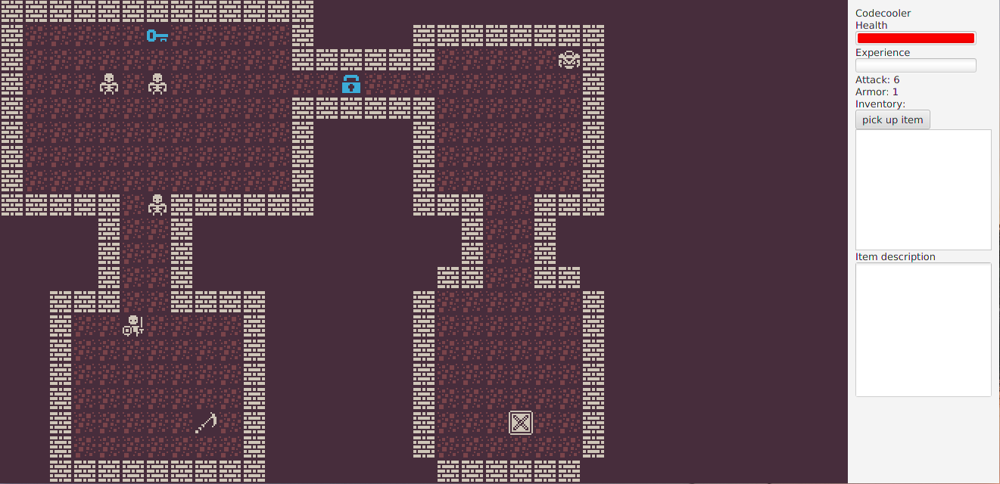
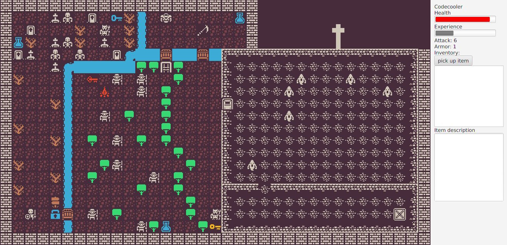

# Skeleton-Quest

This is a simple rougelike game, where player has to defeat enemies and collect items to complete levels. Its main goal was to practice OOP paradigms in Java such as polymorphism, inheritance, encapsulation and abstraction. Additionaly I took the first steps into multi-threading to separate the logic and the graphic layers.

## Screenshots

Level 1:

Level 2:

## Tech Stack 
- Java 8 SE
- JavaFX
- Maven

## Goals
The purpose of this project was to practice following subjects:
- practical implementation of polymorphism, abstraction, encapsulation and inheritance,
- access modifiers,
- interfaces,
- multi-threading,
- creating desktop application UI in JavaFX,
- managing project dependencies through Maven,
- reading pictures from a part of bitmap,
- generating map from a text file.

## Implemented Features
- player's movement,
- enemy's random movement with obstacle recognition,
- items' collection,
- inventory,
- player's experience and level-up,
- potions restore health,
- level gaining restore health,
- player can attack enemies,
- enemies can counter-attack player,
- player has defence points which reduce damage taken,
- enemies have different defence points depending on an enemy type,
- enemies have different movement speed depending on an enemy type,
- keys to unlock doors.

## Setup

This is a Maven project, so you will need to open `pom.xml`.

The project is using JavaFX.  Use the `javafx` maven plugin to build and run the program.
